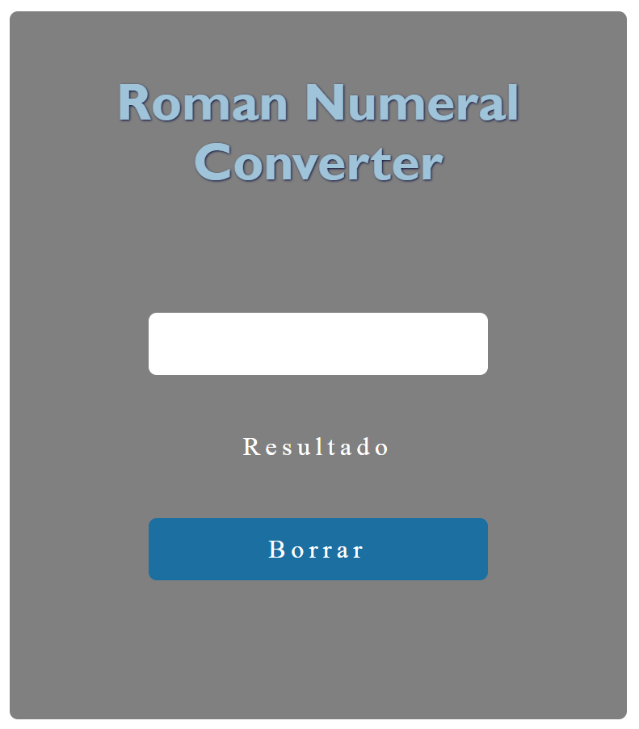

<h2>Purpose</h2>

The aim of this project is to create an app that given a number it creates the equivalent roman number in real time.
<h2>Screenshot</h2>  

<h2>See it live</h2>
<a href="https://amapola-negra.github.io/freeCodeCamp-Projects-Repo/Roman-Number-Converter/">Roman Number Converter</a>
